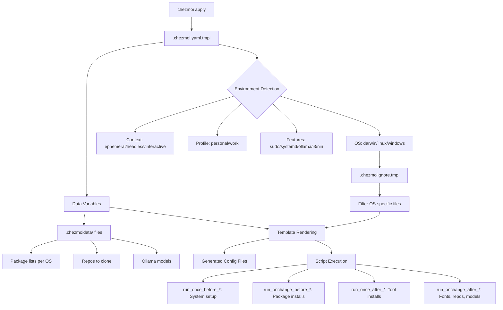

# Architecture

> Last mapped: 2026-05-07

## Overview

This is a **cross-platform dotfiles repository** managed by [chezmoi](https://chezmoi.io), supporting macOS (Darwin), Linux (Arch, Ubuntu), Windows, and WSL. The architecture uses chezmoi's template system to generate OS-specific configurations from a single source of truth.

## Architectural Pattern

**Template-driven declarative configuration** with:
- **Go templates** for conditional OS/environment logic
- **Data-driven package management** via `.chezmoidata/`
- **Ordered script execution** via chezmoi's `run_once_`/`run_onchange_` lifecycle hooks
- **Age encryption** for secrets management
- **External resources** for third-party assets (themes, plugins)

## Core Layers

```
┌─────────────────────────────────────────────────────────────┐
│                    chezmoi apply                             │
├─────────────────────────────────────────────────────────────┤
│  1. CONFIG LAYER     .chezmoi.yaml.tmpl                     │
│     Environment detection, feature flags, data consolidation│
├─────────────────────────────────────────────────────────────┤
│  2. DATA LAYER       .chezmoidata/{os}/                     │
│     Package lists, fonts, repos, ollama models              │
├─────────────────────────────────────────────────────────────┤
│  3. TEMPLATE LAYER   .chezmoitemplates/{os,common,workplace}│
│     Reusable guard scripts, helper functions                │
├─────────────────────────────────────────────────────────────┤
│  4. SCRIPT LAYER     .chezmoiscripts/{os}/                  │
│     Installation hooks (run_once_, run_onchange_)           │
├─────────────────────────────────────────────────────────────┤
│  5. CONFIG FILES     private_dot_config/, dot_zshrc.d/, ... │
│     Application configuration files (some templated)        │
├─────────────────────────────────────────────────────────────┤
│  6. EXTERNAL LAYER   .chezmoiexternals/                     │
│     Third-party git repos, theme files, font archives       │
├─────────────────────────────────────────────────────────────┤
│  7. SECRETS LAYER    encrypted_*.age files                  │
│     API keys, SSH keys, VPN certs, GPG keys                 │
└─────────────────────────────────────────────────────────────┘
```

## Data Flow



## Entry Points

### Primary: `chezmoi apply`
The main entry point. Reads `.chezmoi.yaml.tmpl`, detects environment, renders templates, executes scripts.

### Configuration Entry: `.chezmoi.yaml.tmpl`
The most critical file — performs extensive environment detection:

1. **CI detection** — GitHub Actions, GitLab CI, Travis, CircleCI, Jenkins, Buildkite, Drone
2. **Cloud IDE detection** — Codespaces, Gitpod, Replit
3. **Container detection** — Docker, Podman, LXC, Distrobox, Lima, Kubernetes
4. **Display detection** — X11, Wayland, WSL GUI probe
5. **Profile determination** — personal vs work (based on hostname)
6. **Feature flags** — sudo, systemd, kernels, ollama mode, window managers

### Shell Entry: `dot_zshrc.tmpl`
Sources all numbered files from `dot_zshrc.d/` directory in order.

## Key Abstractions

### Template Guards (`.chezmoitemplates/`)
Reusable template snippets used as guards in scripts:

| Guard | Purpose | Location |
|-------|---------|----------|
| `script_helper` | Common helper functions | `common/script_helper` |
| `script_eval_mise` | Mise activation | `common/script_eval_mise` |
| `script_is_not_ephemeral` | Skip in CI/containers | `common/script_is_not_ephemeral` |
| `script_is_not_headless` | Skip without GUI | `common/script_is_not_headless` |
| `script_validate_completions_path` | Ensure completions dir | `common/script_validate_completions_path` |
| `script_linux_only` | Skip on non-Linux | `linux/script_linux_only` |
| `script_arch_based_only` | Skip on non-Arch | `linux/script_arch_based_only` |
| `script_ubuntu_only` | Skip on non-Ubuntu | `linux/script_ubuntu_only` |
| `script_darwin_only` | Skip on non-macOS | `darwin/script_darwin_only` |
| `script_windows_only` | Skip on non-Windows | `windows/script_windows_only` |
| `script_is_zup` | Work (Zup) environment | `workplace/script_is_zup` |
| `script_is_not_zup` | Not work environment | `workplace/script_is_not_zup` |
| `script_is_instivo` | Instivo work context | `workplace/script_is_instivo` |

### Script Naming Convention
Scripts use a numeric ordering scheme:

| Range | Phase | Timing |
|-------|-------|--------|
| 100-199 | System-level setup (kernels, swap, drivers, package managers) | `run_once_before_` |
| 200-299 | Package installation & basic config | `run_once_before_` / `run_onchange_before_` |
| 500-599 | Tool installation (ollama, mise, AI CLIs, VPN) | `run_once_after_` / `run_onchange_after_` |
| 600-699 | Configuration & repo cloning | `run_onchange_after_` / `run_once_after_` |

### Modular Application Configurations
For complex applications, configurations are split into modular components rather than monolithic files:
- **Niri WM**: `private_dot_config/niri/config.kdl` includes modular files from `cfg/` (e.g., `autostart.kdl`, `keybinds.kdl`, `rules.kdl`).
- **Zsh**: The `dot_zshrc.d/` directory pattern breaks the monolithic shell config into 20+ purpose-specific files.
- **Firefox Profiles**: Templated `profiles.ini.tmpl` and `user.js.tmpl` to manage browser environments cleanly.

### Reproducible Dev Environments
Instead of relying on global package installations for project dependencies, the dotfiles leverage **Nix Flakes** and **Devenv** (`private_dot_local/private_share/environments/`). This provides isolated, declarative development environments for specific microservices and languages (Java, PHP, Node, Python).

### chezmoi File Naming
Uses chezmoi's naming conventions for file attributes:
- `dot_` → `.` (hidden files)
- `private_` → file permissions restricted
- `encrypted_` → decrypted at apply time with age
- `readonly_` → read-only permissions
- `.tmpl` suffix → processed as Go template

## Security Model

- **Encryption**: age with a local identity key + recipient public key
- **Encrypted assets**: API keys, SSH keys, GPG keys, VPN certificates, service credentials
- **17 encrypted `.age` files** in the repo
- **No plaintext secrets** in version control
- **Workplace guard templates** isolate work-specific configs
