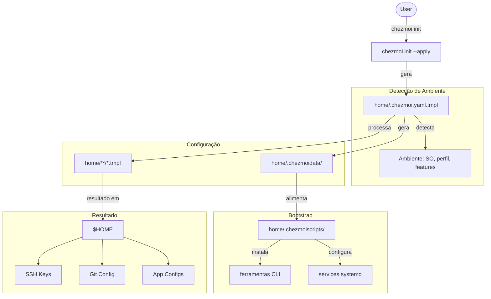

# Architecture — Arquitetura do Sistema

> Arquitetura do repositório de dotfiles chezmoi, incluindo fluxos de dados, abstrações e separação de responsabilidades.

## Visão Geral

Este repositório codifica um **ambiente de operação completo** — não apenas "alguns arquivos de shell". Ele representa: ambiente de shell modular, editor e multiplexor de terminal, ferramentas CLI modernas, segredos criptografados, integração com IA local/remota e fluxos de sincronização.

Arquitetura em 3 camadas:

```
┌─────────────────────────────────────────────────────────────┐
│                    CAMADA DE CONFIGURAÇÃO                    │
│  home/.chezmoi.yaml.tmpl  →  Detecção de SO/perfil/features │
│  home/**/*.tmpl           →  Templates Go text/template       │
│  home/.chezmoidata/       →  Dados declarativos por SO       │
├─────────────────────────────────────────────────────────────┤
│                    CAMADA DE EXECUÇÃO                        │
│  home/.chezmoiscripts/    →  Hooks e scripts de bootstrap    │
│  home/.chezmoitemplates/  →  Guards e helpers reutilizáveis  │
│  home/.chezmoiexternals/  →  Dependências externas           │
├─────────────────────────────────────────────────────────────┤
│                    CAMADA DE RESULTADO                       │
│  $HOME/.config/           →  Configurações de apps           │
│  $HOME/.local/            →  Binários, dados, caches         │
│  $HOME/.ssh/              →  Chaves SSH (descriptografadas)  │
│  systemd user services    →  Serviços em background          │
└─────────────────────────────────────────────────────────────┘
```

## Diagrama de Componentes


```mermaid
graph TD
    User([User]) -->|chezmoi init| Init[chezmoi init --apply]
    Init -->|gera| Config[home/.chezmoi.yaml.tmpl]
    Config -->|detecta| Env[Ambiente: SO, perfil, features]
    Config -->|gera| Data[home/.chezmoidata/]
    Data -->|alimenta| Scripts[home/.chezmoiscripts/]
    Scripts -->|instala| Tools[ferramentas CLI]
    Scripts -->|configura| Services[services systemd]
    Config -->|processa| Templates[home/**/*.tmpl]
    Templates -->|resultado em| Home[$HOME]
    Home --> SSH[SSH Keys]
    Home --> Git[Git Config]
    Home --> Apps[App Configs]

    subgraph "Detecção de Ambiente"
        Config
        Env
    end

    subgraph "Bootstrap"
        Scripts
        Tools
        Services
    end

    subgraph "Configuração"
        Templates
        Data
    end

    subgraph "Resultado"
        Home
        SSH
        Git
        Apps
    end
```

## Fluxo de Bootstrap

```
1. chezmoi init --apply fabiosouzadev
        │
        ▼
2. .chezmoi.yaml.tmpl executa (Go template)
   ├── Detecta SO (macOS, Linux Arch/Ubuntu, Windows, Termux)
   ├── Detecta ambiente (headless, ephemeral, interactive, managed)
   ├── Detecta perfil (work, personal, vps)
   ├── Detecta features (sudo, systemd, AI tools, WMs)
   └── Gera data dict para templates
        │
        ▼
3. .chezmoiscripts/ executam em ordem numérica
   ├── 0xx: Base packages (termux, etc.)
   ├── 1xx: Core tools (zsh, nix, kernels, drivers)
   ├── 2xx: Dev environment (fonts, wm, nvim compile)
   ├── 3xx: AI/CLI tools (ollama, aider, claude, etc.)
   ├── 5xx: Services & integrations (caddy, tailscale, mise, etc.)
   └── 6xx: Post-install (cron deploy, repo clone, sync)
        │
        ▼
4. Templates processados (Go text/template)
   ├── dot_zshrc.d/ — configuração modular do zsh (23 arquivos)
   ├── dot_* — arquivos de configuração do home
   ├── private_dot_config/ — configs privados de apps
   └── private_dot_ssh/ — chaves descriptografadas
        │
        ▼
5. Resultado: ambiente funcional em $HOME
```

## Abstrações Principais

### 1. Detecção de Ambiente (`.chezmoi.yaml.tmpl`)

O arquivo central de orquestração. Usa Go templates para detectar:

| Variável | Descrição | Como Detecta |
|----------|-----------|-------------|
| `$ci` | Ambiente CI | Env vars: CI, GITHUB_ACTIONS, GITLAB_CI, etc. |
| `$codespaces` | GitHub Codespaces | Env var: CODESPACES |
| `$devContainer` | DevContainers | Env var: REMOTE_CONTAINERS, DEVCONTAINER |
| `$inContainer` | Qualquer container | Docker, Podman, cgroup, /.dockerenv |
| `$sshSession` | SSH remoto | Env var: SSH_CONNECTION |
| `$wsl` | WSL | `chezmoi.os == linux` + kernel release contém "microsoft" |
| `$ephemeral` | Transitório | CI, Codespaces, DevContainers |
| `$headless` | Sem GUI | Sem TTY, sem GUI, WSL, container, SSH, Termux |
| `$interactive` | Interativo | TTY E não headless |
| `$profile` | Perfil | Env CHEZMOI_PROFILE ou hostname (work/personal) |
| `$isVps` | VPS Oracle | Hostname "instance-*", "vps", "vnic", ou Ubuntu+ubuntu user+SSH |
| `$workplace` | Workplace | Zup (quando profile == work) |
| `$guiAvailable` | GUI disponível | CHEZMOI_FORCE_GUI/HIDE, macOS, WSL+probe, DISPLAY/WAYLAND |

**Força manual** via env vars: `CHEZMOI_FORCE_GUI`, `CHEZMOI_FORCE_HEADLESS`, `CHEZMOI_SKIP_SHELL_PROBES`, `CHEZMOI_PROFILE`, `CHEZMOI_VPS`.

### 2. Feature Flags

Recursos são ativados/desativados via flags no `.chezmoi.yaml.tmpl` e `ai_tools.yaml`:

| Feature Flag | Default | Descrição |
|-------------|---------|-----------|
| `features.ai.coding_assistants` | true | Aider, Claude, Copilot, etc. |
| `features.ai.spec_tools` | true | OpenSpec, GSD tools |
| `features.ai.multiplexer` | true | tmux/herdr |
| `features.ai.ollama.install` | true | LLM local |
| `features.sudo.enabled` | auto | Sudo (false em managed) |
| `features.systemd.enabled` | auto | systemd (Linux, não-managed) |
| `features.i3.enabled` | true (Linux) | i3 WM config |
| `features.niri.enabled` | true (Linux) | Niri WM config |

### 3. Modularidade do Zsh

A configuração do Zsh é **totalmente modular** com arquivos numerados em `dot_zshrc.d/` (23 arquivos):

```
0xx  → Ambiente base (zshenv)
1xx  → Zinit (install + plugins + snippets)
2xx  → Atuin + aliases + git-aliases
3xx  → AI assistants (aider, API keys)
5xx  → Contexto corporativo (zup)
6xx  → Gateways de IA (omniroute, hermes, openclaude)
9xx  → Autoload e keybindings
999  → Compinit autoload
```

**Vantagem**: Cada aspecto do shell é isolado em um arquivo, facilitando manutenção e debugging.

### 4. Secrets Management (age + chezmoi)

Segredos são criptografados com **age** e gerenciados via chezmoi:

```
/home/dot_keys/encrypted_*.asc         →  Tokens e chaves gerais
/home/private_dot_ssh/encrypted_*.asc  →  Chaves SSH
/home/private_dot_config/*/encrypted_* →  Configs de apps
/home/dot_zshrc.d/encrypted_*.asc      →  Variáveis de ambiente secretas
```

**Descriptografia no apply**: Chezmoi usa age com a identidade em `~/.config/chezmoi/key.txt` para descriptografar automaticamente durante `chezmoi apply`.

### 5. Dados por Plataforma (`.chezmoidata/`)

Dados declarativos separados por SO:

```
.chezmoidata/
├── repos.json           →  Repositórios Git (pessoal + trabalho)
├── ai_tools.yaml        →  Lista de ferramentas de IA com feature flags
├── omniroute.yaml       →  Configuração OmniRoute
├── ollama.yaml          →  Modelos Ollama
├── idea.yaml            →  IntelliJ IDEA config
├── darwin/
│   ├── fonts.yaml       →  Fontes macOS
│   └── packages.toml    →  Pacotes macOS
├── linux/
│   ├── fonts.yaml       →  Fontes Linux
│   ├── kernels.yaml     →  Kernels Linux
│   ├── linux.wm.json    →  Window manager Linux
│   ├── packages/archlinux.yaml
│   └── packages/ubuntu.json
├── windows/
│   ├── fonts.yaml
│   └── packages.yaml
├── termux/
│   └── data.yaml
└── vps/
    └── features.yaml    →  Features específicas VPS
```

### 6. Hooks de Ciclo de Vida (`.chezmoiscripts/`)

Scripts organizados por SO e número, com prefixos semânticos:

- `run_once_after_NNN-*.sh.tmpl` → Executa **uma vez** após o NNN
- `run_onchange_after_NNN-*.sh.tmpl` → Executa no apply e **re-executa** quando o arquivo muda
- `run_once_before_NNN-*.sh.tmpl` → Executa **uma vez** antes do NNN
- `run_onchange_before_NNN-*.sh.tmpl` → Re-executa quando muda

**Convenção de numeração**: Scripts executam em ordem numérica. Deixar gaps (ex: 500, 505, 530) para inserções futuras.

### 7. Templates Reutilizáveis (`.chezmoitemplates/`)

Helpers Go templates para evitar duplicação:

| Template | Propósito |
|----------|-----------|
| `common/script_is_not_ephemeral` | Exit 0 se ephemeral |
| `common/script_is_not_headless` | Exit 0 se headless |
| `common/script_eval_mise` | Avalia mise no PATH |
| `common/script_helper` | Helpers de shell (info, success, warn) |
| `common/script_validate_completions_path` | Cria diretório de completions |
| `darwin/linux/unix/windows/Windows-specific` | Guards por SO |
| `workplace/script_is_vps` | True se perfil VPS |
| `workplace/script_is_not_vps` | True se NÃO é VPS |
| `workplace/script_is_zup` | True se workplace Zup |
| `workplace/script_is_not_zup` | True se NÃO é Zup |
| `workplace/script_is_instivo` | True se instivo (VPN trabalho) |

## Separamento de Responsabilidades

```
home/
├── dot_* (arquivos públicos de configuração)
│   └── Configurações não-sensíveis compartilháveis
├── private_dot_* (configurações privadas)
│   └── Configurações sensíveis (git, SSH, apps privados)
├── .chezmoi.yaml.tmpl (orquestrador central)
│   └── Detecção de ambiente + feature flags
├── .chezmoidata/ (dados declarativos)
│   └── Listas de pacotes, repositórios, configs por SO
├── .chezmoiscripts/ (automação de bootstrap)
│   └── Scripts de instalação por SO + numbered hooks
├── .chezmoitemplates/ (helpers Go templates)
│   └── Guards e funções reutilizáveis
├── .chezmoiexternals/ (dependências externas)
│   └── Brilhetes, ícones, wallpapers, i3 config
└── dot_keys/ (secrets age-encrypted)
    └── Chaves para descriptografar variáveis de ambiente

docs/
├── ARCHITECTURE.md         →  Visão geral arquitetural
├── CONFIGURATION.md        →  Variáveis e settings
├── GETTING-STARTED.md      →  Instalação
├── DEVELOPMENT.md          →  Como contribuir
├── TESTING.md              →  Testes e verificação
├── HERMES-BACKUP.md        →  Modelo de backup do Hermes
├── OMNIROUTE-BACKUP.md     →  Modelo de backup do OmniRoute
├── KEYMAPS.md              →  Atalhos
├── FORK-GUIDE.md           →  Como fazer fork
├── WINDOWS-SETUP.md        →  Setup Windows
└── fork/
    ├── CHEZMOI-VARS.md     →  Guia de variáveis
    └── SECRETS-GUIDE.md    →  Guia de segredos
```

## Cross-Platform Strategy

| Aspecto | Estratégia |
|---------|-----------|
| **Scripts** | Separados por SO: `darwin/`, `linux/`, `windows/`, `termux/`, `unix/` (shared macOS+Linux) |
| **Scripts universais** | `home/.chezmoiscripts/unix/` compartilhado entre macOS e Linux |
| **Detecção** | `.chezmoi.yaml.tmpl` detecta SO, container, TTY, GUI |
| **Packages** | `.chezmoidata/{darwin,linux,windows,termux}/` |
| **Templates** | Go templates com condicionais por SO (`eq .chezmoi.os "darwin"`) |
| **Numbered hooks** | Mesma numeração permite execução ordenada cross-platform quando aplicável |

## Dependências Externas

Gerenciadas via `.chezmoiexternals/` (instalação automática pelo chezmoi):

- **Firefox**: Homebrew cask ou equivalente
- **Nerd Fonts/icons**: Tema de ícones para terminal
- **i3 config**: Configuração adicional do i3
- **Wallpapers**: Coleção de wallpapers pessoais
- **tmux config**: Configuração externa do tmux
- **atuin config**: Config do Atuin
- **git config**: Configuração adicional do git

## Versão do Documento

Gerado automaticamente pelo gsd-map-codebase em 2026-09-16.
