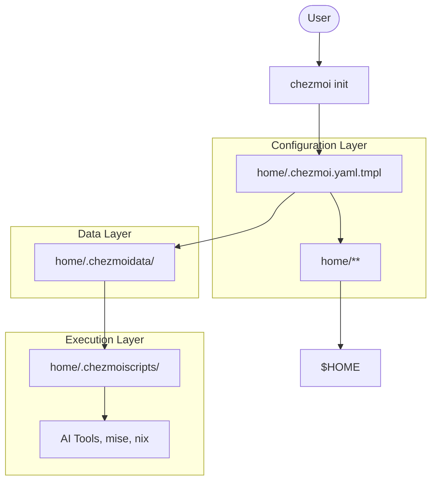

<!-- generated-by: gsd-doc-writer -->
# Architecture

This document describes the high-level architecture and design of these dotfiles.

## System Overview

These dotfiles are built on [chezmoi](https://chezmoi.io), a cross-platform dotfile manager. The system provides a reproducible development environment across macOS, Linux (Arch, Ubuntu), and Windows (WSL). It uses a modular design with clear separation between configuration logic, package data, and installation scripts.

## Component Diagram

## Data Flow

1.  **Environment Detection**: When `chezmoi` is initialized or applied, `.chezmoi.yaml.tmpl` executes. It detects the operating system, hostname, and whether the environment is headless (CI, SSH, container) or interactive.
2.  **Configuration Merging**: Chezmoi merges global data from `.chezmoidata/` with the detected environment settings.
3.  **Bootstrap Execution**: Scripts in `.chezmoiscripts/` are executed in order. These scripts handle package installation (via Homebrew, pacman, apt, winget), font installation, and setup of specialized tools like AI assistants.
4.  **Template Application**: Files in the `home/` directory are processed. Chezmoi applies templates (using Go `text/template` syntax) to inject environment-specific values and feature flags.
5.  **Deployment**: The processed files are written to the user's home directory.

## Key Abstractions

-   **Environment Flags**: Boolean flags like `headless`, `ephemeral`, and `guiAvailable` determined in `.chezmoi.yaml.tmpl` that control which features are enabled.
-   **Modular Zsh**: Configuration is split into numbered files in `dot_zshrc.d/`, allowing for easy organization and conditional loading.
-   **Package Lists**: YAML/TOML files in `.chezmoidata/` that define which packages to install on each platform, separating data from installation logic.
-   **Secret Management**: Uses `age` to decrypt sensitive files (SSH keys, API tokens) on the fly during deployment.

## Directory Structure Rationale

-   `home/`: The source of truth for the home directory.
    -   `.chezmoidata/`: Data files for package management and system settings.
    -   `.chezmoiscripts/`: Lifecycle scripts (pre-install, post-install).
    -   `.chezmoitemplates/`: Reusable template snippets.
    -   `dot_zshrc.d/`: Modular Zsh configuration files.
    -   `private_dot_config/`: Application-specific configurations (Neovim, tmux, etc.).
-   `docs/`: Detailed guides and architectural documentation.
-   `.planning/`: Project management and GSD methodology artifacts.
